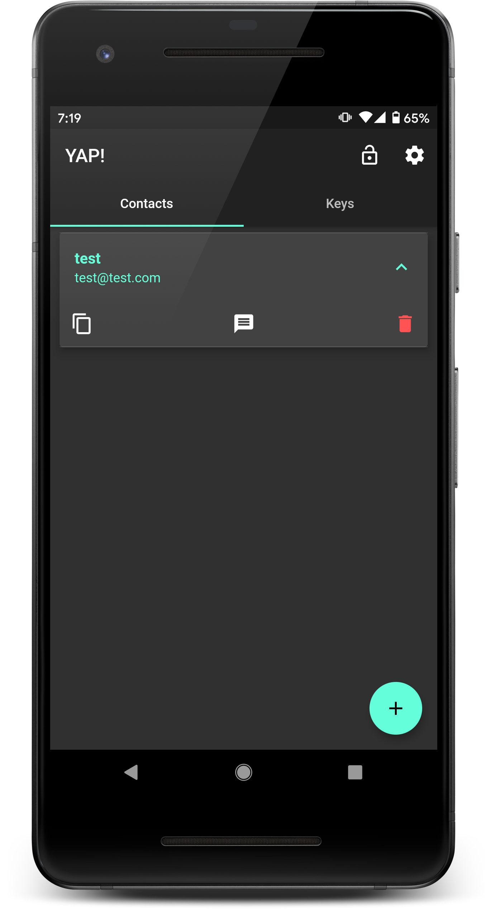
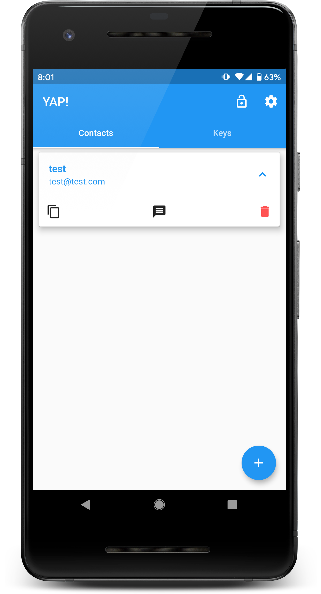
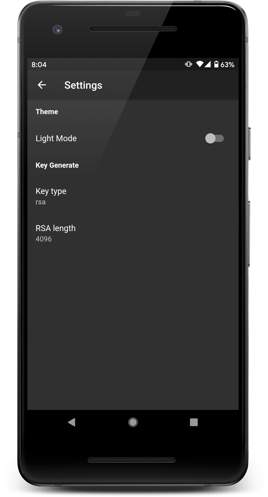
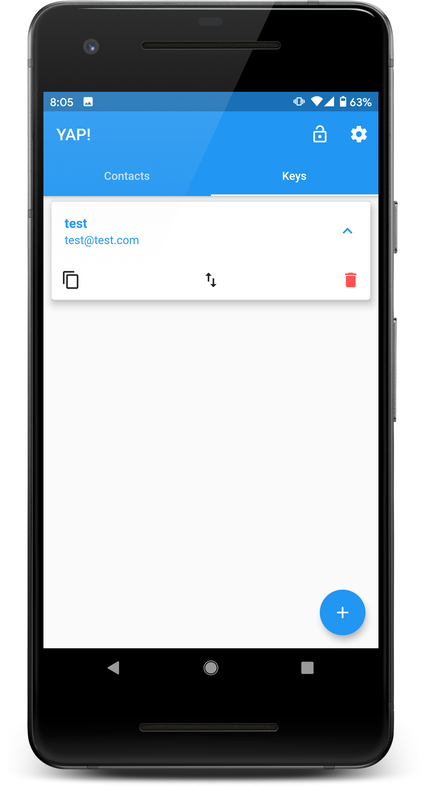
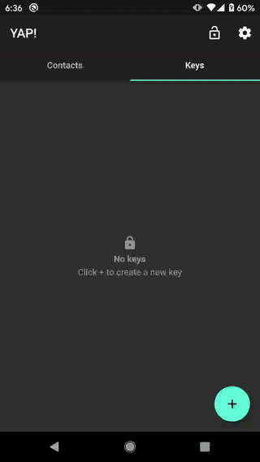
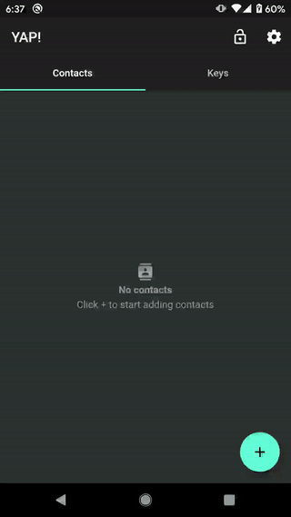
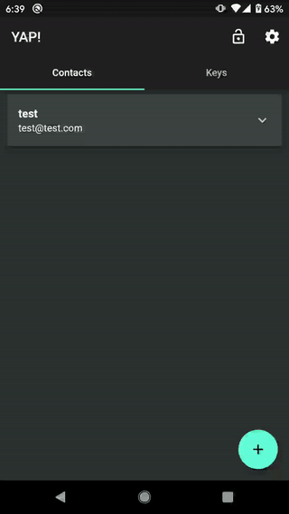
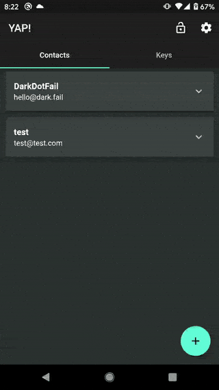
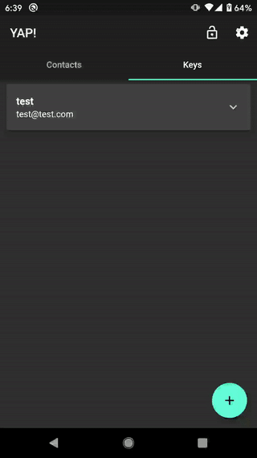

[![Contributors][contributors-shield]][contributors-url]
[![Forks][forks-shield]][forks-url]
[![Stargazers][stars-shield]][stars-url]
[![Issues][issues-shield]][issues-url]
[![MIT License][license-shield]][license-url]
[](https://gitter.im/yap_app/community?utm_source=badge&utm_medium=badge&utm_campaign=pr-badge&utm_content=badge)

<br />
<p align="center">
  <h3 align="center">YAP!</h3>

  <p align="center">
    Yet Another PGP Tool!
    <br />
    <a href="https://github.com/MarinX/yap/releases">Download Release</a>
    ·
    <a href="https://github.com/MarinX/yap/issues">Report Bug</a>
    ·
    <a href="https://github.com/MarinX/yap/issues">Request Feature</a>
  </p>
</p>


## Table of Contents

* [About YAP!](#about-the-project)
  * [Built With](#built-with)
* [Getting Started](#getting-started)
  * [Prerequisites](#prerequisites)
  * [Building](#building)
  * [Installation](#installation)
* [Usage](#usage)
* [Roadmap](#roadmap)
* [Contributing](#contributing)
* [License](#license)
* [Contact](#contact)


## About YAP!

<p float="left">




</p
  
// TODO

**Secure storage**

On Android, AES encryption is used. AES secret key is encrypted with RSA and RSA key is stored in [KeyStore](https://developer.android.com/training/articles/keystore.html)

On iOS, [Keychain](https://developer.apple.com/documentation/security/keychain_services#//apple_ref/doc/uid/TP30000897-CH203-TP1) is used.

### Built With

* [Flutter](https://flutter.dev/)

For PGP, a high level OpenPGP library is used - [gopenpgp](https://github.com/ProtonMail/gopenpgp) which is compiled with [gomobile](https://godoc.org/golang.org/x/mobile/cmd/gomobile) for mobile support.


## Getting Started

If you want to compile and build locally, check the `prerequisites` and `building` sections.

Alternative, you can view the [release](https://github.com/MarinX/yap/releases) section of the project and download APK.

For iOS users, Apple does not allow installing an app outside their eco-system(store), so you will need to compile and build (***not yet supported***)

### Prerequisites

To compile / build, you will need
* [Flutter](https://flutter.dev/docs/get-started/install)
* [Android SDK with NDK](https://developer.android.com/studio) (for Android builds)
* [Xcode](https://developer.apple.com/xcode/) (for iOS builds)

**note, iOS builds are not yet supported**


### Building
* Inside project run, get dependencies by running
```sh
flutter pub get
```

* Building for Android

[Build and release an Android app](https://flutter.dev/docs/deployment/android)

* Building for iOS (not supported yet)

[Build and release iOS app](https://flutter.dev/docs/deployment/ios)

### Installation

***Recommended***

* Use [release](https://github.com/MarinX/yap/releases) section to download and install

***Other***
* If you have phone connected and want to install 
```sh
flutter run --release
```

## Usage


### Creating an PGP key



### Adding contact



### Encrypting a message


### Decrypting a message



### Verifying signature



### Settings




## Roadmap

See the [open issues](https://github.com/othneildrew/Best-README-Template/issues) for a list of proposed features (and known issues).


## Contributing

Contributions are what make the open source community such an amazing place to be learn, inspire, and create. Any contributions you make are **greatly appreciated**.

1. Fork the Project
2. Create your Feature Branch (`git checkout -b feature/AmazingFeature`)
3. Commit your Changes (`git commit -m 'Add some AmazingFeature'`)
4. Push to the Branch (`git push origin feature/AmazingFeature`)
5. Open a Pull Request


## License

Distributed under the MIT License. See `LICENSE` for more information.

## Contact

Marin Basic - [@marin02basic](https://twitter.com/marin02basic) - marin.basic02@gmail.com

Project Link: [https://github.com/MarinX/yap](https://github.com/MarinX/yap)


[contributors-shield]: https://img.shields.io/github/contributors/MarinX/yap.svg?style=flat-square
[contributors-url]: https://github.com/MarinX/yap/graphs/contributors
[forks-shield]: https://img.shields.io/github/forks/MarinX/yap.svg?style=flat-square
[forks-url]: https://github.com/MarinX/yap/network/members
[stars-shield]: https://img.shields.io/github/stars/MarinX/yap.svg?style=flat-square
[stars-url]: https://github.com/MarinX/yap/stargazers
[issues-shield]: https://img.shields.io/github/issues/MarinX/yap.svg?style=flat-square
[issues-url]: https://github.com/MarinX/yap/issues
[license-shield]: https://img.shields.io/github/license/MarinX/yap.svg?style=flat-square
[license-url]: https://github.com/MarinX/yap/blob/master/LICENSE
